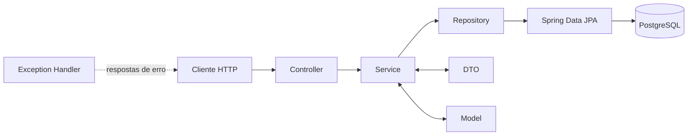

<div align="center">

# ☀️ Apollo API

### Gestão inteligente do ciclo de vida de painéis solares

API REST desenvolvida para centralizar o cadastro de lotes, painéis solares,
unidades empresariais e registros de manutenção do ecossistema **Apollo**.

[](https://openjdk.org/projects/jdk/21/)
[](https://spring.io/projects/spring-boot)
[](https://www.postgresql.org/)
[](https://docs.docker.com/compose/)
[](LICENSE)

</div>

---

## Sobre o projeto

O **Apollo API** é o back-end do Projeto Interdisciplinar Apollo. A solução foi
pensada para apoiar o acompanhamento de ativos fotovoltaicos, desde a aquisição
em lote e instalação dos painéis até o registro de manutenções.

Nesta etapa, a aplicação disponibiliza operações CRUD para **lotes** e
**painéis**, além de já possuir a modelagem inicial de empresas, unidades,
endereços, usuários, perfis de acesso, segmentos e manutenções.

## Funcionalidades atuais

- Cadastro, consulta, atualização e exclusão de lotes de painéis;
- cadastro, consulta, atualização e exclusão de painéis solares;
- associação de cada painel ao seu lote de origem;
- persistência em banco de dados PostgreSQL com Spring Data JPA;
- conversão entre entidades e DTOs na camada de serviço;
- resposta HTTP `404 Not Found` centralizada para recursos inexistentes;
- criação e atualização automática do esquema pelo Hibernate;
- ambiente PostgreSQL reproduzível com Docker Compose.

## Arquitetura

O projeto segue uma arquitetura em camadas, mantendo as responsabilidades da
API separadas:



```text
src/
├── main/
│   ├── java/org/apollo/api/
│   │   ├── controller/   # Endpoints REST
│   │   ├── dto/          # Objetos de entrada e saída
│   │   ├── enums/        # Estados controlados do domínio
│   │   ├── exception/    # Exceções e tratamento centralizado
│   │   ├── model/        # Entidades JPA
│   │   ├── repository/   # Acesso aos dados
│   │   └── service/      # Regras e casos de uso
│   └── resources/        # Configuração da aplicação
└── test/                 # Testes automatizados
```

## Tecnologias

| Tecnologia | Uso no projeto |
|---|---|
| Java 21 | Linguagem principal |
| Spring Boot 4.1 | Configuração e execução da aplicação |
| Spring Web MVC | Construção dos endpoints REST |
| Spring Data JPA | Persistência e acesso ao banco |
| PostgreSQL 17 | Banco de dados relacional |
| Hibernate | Mapeamento objeto-relacional |
| Lombok | Redução de código repetitivo |
| Maven Wrapper | Build e gerenciamento de dependências |
| Docker Compose | Banco local conteinerizado |

## Como executar

### Pré-requisitos

- [Java 21](https://adoptium.net/temurin/releases/?version=21);
- [Docker Desktop](https://www.docker.com/products/docker-desktop/) com Docker
  Compose.

> O Maven não precisa ser instalado: o repositório inclui o Maven Wrapper.

### 1. Clone o repositório

```bash
git clone https://github.com/ApolloOficial/Apollo-API-Spring.git
cd Apollo-API-Spring
```

### 2. Inicie o PostgreSQL

```bash
docker compose up -d
```

O container será iniciado na porta `5432` e armazenará os dados no volume
`apollo_postgres_data`.

### 3. Execute a API

No Windows:

```powershell
.\mvnw.cmd spring-boot:run
```

No Linux ou macOS:

```bash
./mvnw spring-boot:run
```

A aplicação ficará disponível em `http://localhost:8080`.

> O Spring Security já consta nas dependências, mas a autenticação definitiva
> da API ainda está em desenvolvimento. Enquanto não houver uma configuração
> própria, o Spring poderá gerar uma senha temporária no console ao iniciar.

## Variáveis de ambiente

A aplicação possui valores locais padrão, que podem ser sobrescritos sem
alterar o código-fonte:

| Variável | Padrão | Descrição |
|---|---|---|
| `DB_HOST` | `localhost` | Host do PostgreSQL |
| `DB_PORT` | `5432` | Porta do PostgreSQL |
| `DB_NAME` | `dbapollo` | Nome do banco |
| `DB_USER` | `apollo` | Usuário do banco |
| `DB_PASSWORD` | `apollo123` | Senha do banco |

Exemplo no PowerShell:

```powershell
$env:DB_HOST = "localhost"
$env:DB_PORT = "5432"
$env:DB_NAME = "dbapollo"
$env:DB_USER = "apollo"
$env:DB_PASSWORD = "sua_senha"
.\mvnw.cmd spring-boot:run
```

> Em produção, utilize segredos da plataforma de hospedagem e nunca versione
> credenciais reais.

## Endpoints disponíveis

### Lotes

Base URL: `/api/v1/batches`

| Método | Rota | Ação |
|---|---|---|
| `GET` | `/api/v1/batches` | Lista todos os lotes |
| `GET` | `/api/v1/batches/{id}` | Consulta um lote pelo ID |
| `POST` | `/api/v1/batches` | Cadastra um lote |
| `PUT` | `/api/v1/batches/{id}` | Atualiza um lote |
| `DELETE` | `/api/v1/batches/{id}` | Exclui um lote |

Exemplo de corpo para criação:

```json
{
  "billNumber": "NF-2026-001",
  "manufacturer": "Solar Tech",
  "model": "ST-550M",
  "acquisitionDt": "2026-05-14",
  "panelsQtt": 100
}
```

### Painéis

Base URL: `/api/panels`

| Método | Rota | Ação |
|---|---|---|
| `GET` | `/api/panels` | Lista todos os painéis |
| `GET` | `/api/panels/{id}` | Consulta um painel pelo ID |
| `POST` | `/api/panels` | Cadastra um painel |
| `PUT` | `/api/panels/{id}` | Atualiza um painel |
| `DELETE` | `/api/panels/{id}` | Exclui um painel |

Exemplo de corpo para criação:

```json
{
  "batchId": 1,
  "coUnityId": 10,
  "estimatedLifeCycle": 25,
  "serialNumber": "APL-ST550-0001",
  "barcode": "789000000001",
  "operatingStatsEnum": "Operacional",
  "ratedEfficiency": 21.5,
  "installationDt": "2026-06-01"
}
```

O campo `batchId` deve apontar para um lote já cadastrado.

## Requisitos da disciplina — Desenvolvimento 2

Esta seção relaciona a implementação atual aos critérios definidos para a
disciplina em maio de 2026.

| Requisito | Situação | Evidência no projeto |
|---|:---:|---|
| API REST em Java com Spring MVC e PostgreSQL | ✅ | Controllers REST, Spring Web MVC e configuração do datasource PostgreSQL |
| Integração com PostgreSQL usando Spring Data JPA | ✅ | Entidades JPA e interfaces em `repository/` |
| Métodos CRUD por meio da API | ✅ | CRUD completo de lotes e painéis |
| Separação de responsabilidades no padrão MVC | ✅ | Pacotes `controller`, `service`, `repository`, `model` e `dto` |
| Validação das entradas recebidas | 🚧 | Restrições existem nas entidades; validação de DTOs com Bean Validation ainda é necessária |
| Tratamento centralizado de exceções e respostas HTTP úteis | 🚧 | `GlobalExceptionHandler` trata recursos não encontrados; demais erros ainda precisam ser padronizados |
| Documentação automática com Swagger | ⏳ | Planejado |
| Acionamento de procedures e functions do banco | ⏳ | Planejado |
| Autenticação e autorização com Spring Security | 🚧 | Dependências de Spring Security e JWT adicionadas; fluxo de autenticação ainda não concluído |
| API REST adicional para banco NoSQL | ⏳ | Extra planejado |

**Legenda:** ✅ concluído · 🚧 em desenvolvimento · ⏳ planejado

## Próximos passos

- Adicionar Bean Validation aos DTOs e `@Valid` nos controllers;
- padronizar respostas de erro para validação, regras de negócio e banco;
- concluir autenticação e autorização com Spring Security e JWT;
- documentar os endpoints com OpenAPI/Swagger;
- ampliar os CRUDs para as demais entidades do domínio;
- adicionar testes unitários, de integração e de controller;
- integrar procedures e functions desenvolvidas no PostgreSQL;
- preparar configuração segura para implantação em nuvem.

## Testes

Execute a suíte automatizada com:

No Windows:

```powershell
.\mvnw.cmd test
```

No Linux ou macOS:

```bash
./mvnw test
```

## Contribuição

1. Crie uma branch a partir de `main`: `git switch -c feat/minha-feature`;
2. faça commits seguindo o padrão
   [Conventional Commits](https://www.conventionalcommits.org/pt-br/v1.0.0/);
3. envie a branch para o GitHub;
4. abra um Pull Request descrevendo a alteração e como validá-la.

## Licença

Distribuído sob a licença MIT. Consulte o arquivo [LICENSE](LICENSE) para mais
informações.

---

<div align="center">

Desenvolvido pela equipe **Apollo** para o Projeto Interdisciplinar 2026. 🚀

</div>
